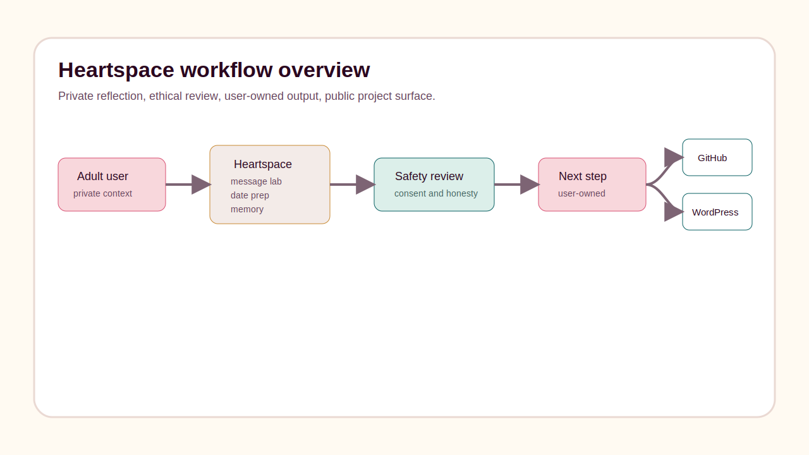
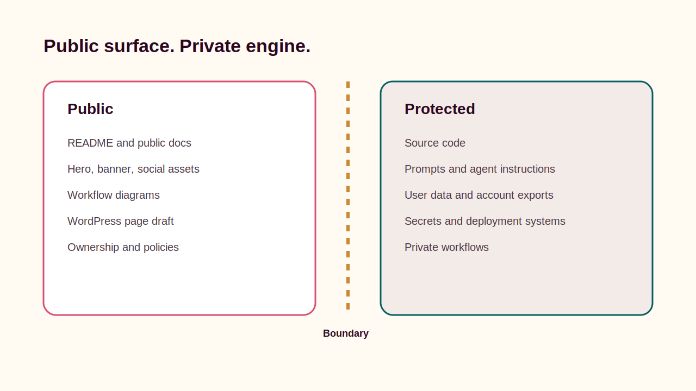

# Heartspace

**Heartspace** is a privacy-first relationship wingman and memory system by
Faith Cheltenham. It helps adults practice messages, prepare for dates, remember
relationship context, check assumptions, and protect their own pacing without
turning connection into swiping, scraping, impersonation, or manipulation.

This repository is a protected public project surface. It is not the full source
code, operational system, private workflow, or data room.

## Why It Matters

Most relationship tooling pushes speed, performance, and extraction. Heartspace
points the other way: toward consent, honesty, reflection, self-respect,
reciprocity, privacy, and real-world connection.

The public surface explains the project, its boundary, its status, and how it
fits into Faith Cheltenham's broader ecosystem. The private engine remains
protected.

## Who It Is For

- Adults who want message practice without a bot pretending to be them.
- People who want a memory keeper for names, interests, dates, flags, and
  follow-ups.
- Users who need help separating facts from anxious assumptions.
- Product, AI, and trust-and-safety reviewers who want to understand the
  project without seeing private infrastructure.

## How It Works

Heartspace is organized around private, user-controlled workflows:

- **Message Lab:** draft or revise messages while preserving the user's voice.
- **Date Prep:** prepare values questions, logistics, grounding, and safety.
- **Relationship Memory:** remember people, interests, important dates, flags,
  and follow-ups.
- **Reality Check:** separate known facts from assumptions.
- **Privacy Controls:** export and delete account data.

## Public Surface

This public repository may include:

- Project summary and status.
- Public-safe workflow diagrams.
- Public-safe visual assets.
- WordPress page draft copy.
- Ownership, security, and commercial-use policies.
- Launch checklist and receipt.

## Private Engine

This public repository does not include:

- Source code.
- Prompts or agent instructions.
- Credentials, secrets, environment files, or deployment systems.
- Databases, account data, exports, logs, or private workflows.
- Customer, family, medical, legal, benefits, or admin records.

## Current Status

Heartspace exists as an active private project with local and production
planning receipts. The protected public repository package is prepared for
GitHub publication, but remote repository creation was not completed in this
session because GitHub CLI authentication for `thefayth` is invalid.

## Ownership

Copyright Faith Cheltenham. All rights reserved.

No public license is granted. No redistribution, commercial reuse, model
training, scraping, or implied permission is granted.

## Learn More

- Website: https://faithcheltenham.com/
- Planned public path: https://faithcheltenham.com/projects/heartspace/
- Project docs: `docs/`
- WordPress draft: `wordpress/page.md`

